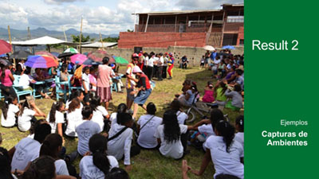

---
# You don't need to edit this file, it's empty on purpose.
# Edit theme's home layout instead if you wanna make some changes
# See: https://jekyllrb.com/docs/themes/#overriding-theme-defaults
layout: default
title: Home
---

<h2>Antecedentes</h2>

Desde la década del 2000, en Honduras, se han impulsado diversas acciones desde la cooperación internacional y la sociedad civil dirigidas a mejorar la calidad de vida del sector juvenil y combatir la falta de oportunidades educativas y laborales, con un enfoque de prevención de la violencia y reducción del empleo precario. Aunque existen enfoques diferentes en estos programas y proyectos, el factor común ha sido el desarrollo de oficios para el emprendimiento y la promoción de valores, con el objetivo de fomentar el autoempleo, reducir el riesgo de afiliación a maras y pandillas, prevenir la migración y dar oportunidades para la generación de ingresos. Sin embargo, estos programas y proyectos ejecutados se concentraron escasamente en articular el desarrollo de valores, capacidades y habilidades en los y las jóvenes con las necesidades laborales del sector privado. 

En este contexto, USAID otorgó a Educación Development Center, Inc. (EDC) el proyecto METAS (Mejorando la Educación para Trabajar, Aprender y Superarse) en septiembre 2010. METAS introdujo un abordaje innovador en relación a la empleabilidad juvenil, que se concentra en la certificación de competencias laborales básicas, en el desarrollo de habilidades para el trabajo, en la alineación de la educación con las necesidades del sector laboral y en la generación de alianzas estratégicas con el sector privado para brindar oportunidades de pasantías y empleo, a través de la Estrategia Puente. 

<h2>Objetivo </h2>

El objetivo del Proyecto METAS fue ayudar a Honduras y sobre todo a la juventud hondureña brindándoles la oportunidad de adquirir conocimientos y habilidades para la vida y el trabajo y las actitudes, comportamientos y perspectivas necesarias para crear futuros positivos y prometedores; así como, satisfacer necesidades del sector privado en relación a la contratación de talento humano. 

<h2>Fases</h2>

El proyecto recibió dos extensiones en tiempo y financiamiento de USAID para generar las condiciones de sostenibilidad para la transferencia de su Programa de Competencias Laborales Básicas (PCLB) y además, ampliar sus servicios al ofrecer el programa de vinculación laboral para los y las jóvenes participantes.
Fases del Proyecto METAS

<h3 style="text-align: center"><em>Fases del Proyecto METAS</em></h3>

<h3>Componentes:</h3>
<ul>
<li> <strong>Componente 1: “Ampliación de Oportunidades para Mejorar los Servicios a la Juventud en Riesgo Social”</strong> Tuvo como objetivo prestar servicios de apoyo orientados a desarrollar y fortalecer las habilidades de empleabilidad, sociales y para la vida a jóvenes en riesgo social. Así como, proporcionar a organizaciones no gubernamentales de desarrollo (ONGD) subvencionadas, apoyo, acompañamiento y asistencia técnica para el fortalecimiento de sus capacidades institucionales. </li>
<li> <strong>Componente 2: “Fortalecimiento a Programas Alternativos de Educación (PAE)”</strong> Su objetivo fue mejorar la sostenibilidad, el acceso y calidad de los programas alternativos de educación secundaria para los y las jóvenes en las comunidades; a través del trabajo con comunidades, facilitadores y la Secretaría de Educación. </li>
<li> <strong> Componente 3: “Capacitación y Certificación en Competencias Laborales Básicas” </strong> Se centró en capacitar y certificar a los y las jóvenes en el Programa de Competencias Laborales Básicas, desarrollando sus habilidades para el éxito en el trabajo y en la vida.  Asimismo, tuvo como objetivo capacitar a docentes-facilitadores en la implementación del programa y asegurar la transferencia sostenible del programa a dos instituciones locales. </li>
<li>  <strong> Componente 4: “Alianzas Estratégicas que Generan Oportunidades de Empleo y Mejoran la Empleabilidad de Jóvenes Beneficiarios de Proyecto METAS” </strong> tuvo como objetivo establecer alianzas estratégicas que contribuyeran a alinear la educación con las necesidades del sector laboral, mejorando las oportunidades de empleo para los y las jóvenes. Durante las fases 2 y 3, se puso énfasis en fortalecer estas alianzas con el sector privado para lograr mayores oportunidades de inserción laboral para los y las jóvenes. </li>
</ul>  
<h3>Resultados: </h3>

 

<ul>
<li>  Fortalecimiento organizacional a 12 ONGDs locales en temas como género, administración y finanzas, monitoreo y evaluación, manejo de proyectos y trabajo con jóvenes en situación de riesgo social. </li>
<li> Desarrollo de características de liderazgo en los y las jóvenes participantes, así como cambios positivos de actitud, a través de la formación en habilidades para la vida.</li>
<li> Empoderamiento de jóvenes empoderados en sus comunidades, se organizan y proyectan para ayudar a otros en los proyectos comunitarios. Además, los y las jóvenes replican con otros sus aprendizajes. </li>
<li>  Formación de Comités de Gestión Educativa - CGE, estructuras comunitarias, que fortalecieron y apoyaron la gestión educativa de los Programas Alternativos de Educación - PAE.</li>
<li>  Formación a los y las facilitadores de los PAE a través del Diplomado en Competencias Sociales y Metodológicas.</li>
<li>  Introducir en Honduras la certificación de reconocimiento internacional de competencias laborales básicas como herramienta para facilitar el acceso de jóvenes al mercado laboral.</li>
<li>  Aumento de la confianza en los y las jóvenes beneficiarios del proyecto, en cuanto a sus posibilidades de vincularse laboralmente, conseguir un mejor empleo o continuar sus estudios profesionales, gracias a las habilidades adquiridas en el Programa de Competencias Laborales Básicas – PCLB (comprensión de lectura, capacidad de resolver problemas prácticos y capacidad de seguir instrucciones)</li>
<li> Sector privado hondureño reconoció los beneficios de incorporar pasantías y empleos para jóvenes participantes del Proyecto METAS dentro de sus procesos de captación del talento humano.</li>
<li>  Mejora en la percepción de las empresas sobre la estigmatización de jóvenes provenientes de localidades con alto riesgo social.</li>
<li>  Jóvenes beneficiarios perciben que ha mejorado su capacidad de ingreso económico y condición social. Lo que se ve reflejado en una mejor experiencia y desempeño laboral de jóvenes en condiciones de vulnerabilidad social.</li>
<li>  Jóvenes califican la pasantía como la mejor experiencia que fortalece su versatilidad en la búsqueda de empleo. Además, los y las beneficiarios han desarrollado capacidades para identificar factores de riesgo que disminuyen sus posibilidades de empleabilidad, así como aquellos factores que potencian su desarrollo.</li>
</ul>

<h3>Impactos: </h3>
<ul>
<li>  Más de 9,000 jóvenes capacitados en programas de formación para la juventud, en cursos tales como: habilidades para la vida, belleza y cosmetología, atención al cliente, reparación de celulares, piñatería, panadería, mercadeo, inglés, refrigeración, etc.</li>
<li>  Más de 6,000 jóvenes completaron el año escolar en un Programa de Educación Alternativo que fue apoyado por Proyecto METAS</li>
<li>  Más de 54,000 jóvenes capacitados a través del Programa de Competencias Laborales Básicas, incluyendo a más de 500 jóvenes que no trabajan y estudian.</li>
<li>  1,000 maestros de educación media capacitados en del Programa de Competencias Laborales Básicas.</li>
<li>  Transferencia de la metodología y fortalecimiento de la capacidad organizacional de dos organizaciones locales (Centro Asesor para el Desarrollo Humano – CADERH y Centro Nacional de Educación para el Trabajo - CENET) para implementar el PCLB de manera sostenible.</li>
<li>  Aproximadamente 4,600 jóvenes recibieron oportunidades de pasantía o empleo dentro de Proyecto METAS.</li>
</ul>
